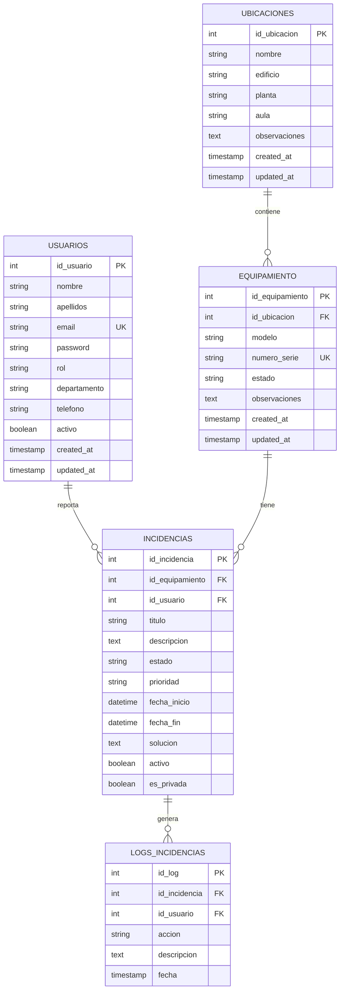

# 📋 GestiTIC - Documentación Completa
## Sistema de Gestión de Equipamiento IT

> **Versión**: 1.0  
> **Fecha**: Diciembre 2024  
> **Autor**: Equipo de Desarrollo  

---

## 📑 Índice

1. [Resumen Ejecutivo](#resumen-ejecutivo)
2. [Arquitectura del Sistema](#arquitectura-del-sistema)
3. [Tecnologías Utilizadas](#tecnologías-utilizadas)
4. [Estructura del Proyecto](#estructura-del-proyecto)
5. [Base de Datos](#base-de-datos)
6. [API Backend (Laravel)](#api-backend-laravel)
7. [Frontend (React)](#frontend-react)
8. [Funcionalidades](#funcionalidades)
9. [Interfaz de Usuario](#interfaz-de-usuario)
10. [Seguridad](#seguridad)
11. [Instalación y Configuración](#instalación-y-configuración)
12. [Guía de Usuario](#guía-de-usuario)
13. [Mantenimiento y Soporte](#mantenimiento-y-soporte)
14. [Anexos](#anexos)

---

## 🎯 Resumen Ejecutivo

**GestiTIC** es una aplicación web moderna y completa diseñada para la gestión integral del equipamiento tecnológico en organizaciones. El sistema permite administrar inventarios de equipos, gestionar ubicaciones, reportar y seguir incidencias técnicas, y administrar usuarios con diferentes niveles de acceso.

### Objetivos Principales
- **Centralizar** la gestión de equipamiento IT
- **Optimizar** el seguimiento de incidencias técnicas
- **Simplificar** la administración de ubicaciones y espacios
- **Mejorar** la eficiencia operativa del departamento IT
- **Proporcionar** una interfaz moderna y responsive

### Beneficios Clave
- ✅ **Trazabilidad completa** del equipamiento
- ✅ **Gestión eficiente** de incidencias
- ✅ **Interfaz responsive** para todos los dispositivos
- ✅ **Roles y permisos** diferenciados
- ✅ **API RESTful** para futuras integraciones

---

## 🏗️ Arquitectura del Sistema

### Arquitectura General
```
┌─────────────────┐    HTTP/HTTPS    ┌─────────────────┐
│   Frontend      │ ──────────────► │   Backend       │
│   (React SPA)   │                 │   (Laravel API) │
│   Puerto 5173   │ ◄────────────── │   Puerto 8000   │
└─────────────────┘     JSON/REST    └─────────────────┘
                                             │
                                             │ Eloquent ORM
                                             ▼
                                     ┌─────────────────┐
                                     │   Base de Datos │
                                     │   (MySQL/SQLite)│
                                     └─────────────────┘
```

### Patrón Arquitectónico
- **Frontend**: SPA (Single Page Application) con React
- **Backend**: API RESTful con Laravel
- **Base de Datos**: Relacional con Eloquent ORM
- **Autenticación**: Laravel Sanctum (Token-based)
- **Comunicación**: HTTP/HTTPS con JSON

### Principios de Diseño
- **Separación de responsabilidades**: Frontend y Backend completamente independientes
- **API-First**: Diseño centrado en la API para facilitar futuras integraciones
- **Responsive Design**: Interfaz adaptativa para dispositivos móviles y desktop
- **Seguridad**: Autenticación robusta y validación de datos
- **Escalabilidad**: Arquitectura modular y extensible

---

## 🛠️ Tecnologías Utilizadas

### Backend (Laravel)
| Tecnología | Versión | Propósito |
|------------|---------|-----------|
| **PHP** | 8.2+ | Lenguaje base del backend |
| **Laravel Framework** | 12.0 | Framework web PHP |
| **Laravel Sanctum** | 4.1 | Autenticación API |
| **Eloquent ORM** | - | Mapeo objeto-relacional |
| **MySQL/SQLite** | - | Base de datos |
| **Composer** | - | Gestor de dependencias PHP |

### Frontend (React)
| Tecnología | Versión | Propósito |
|------------|---------|-----------|
| **React** | 19.0.0 | Biblioteca UI |
| **React Router DOM** | 7.5.3 | Enrutamiento SPA |
| **Material-UI (MUI)** | 7.1.0 | Componentes UI |
| **Framer Motion** | 11.0.3 | Animaciones |
| **Axios** | 1.9.0 | Cliente HTTP |
| **React CountUp** | 6.5.0 | Animaciones numéricas |
| **Vite** | 6.3.1 | Bundler y dev server |

### Herramientas de Desarrollo
- **ESLint**: Linting para JavaScript
- **Composer**: Gestión de dependencias PHP
- **NPM**: Gestión de dependencias Node.js
- **Git**: Control de versiones

---

## 📂 Estructura del Proyecto

```
GestiTIC/
├── 📁 backend/                    # API Laravel
│   ├── 📁 app/
│   │   ├── 📁 Http/
│   │   │   └── 📁 Controllers/     # Controladores API
│   │   │       ├── AuthController.php
│   │   │       ├── UsuarioController.php
│   │   │       ├── UbicacionController.php
│   │   │       ├── EquipamientoController.php
│   │   │       └── IncidenciaController.php
│   │   ├── 📁 Models/              # Modelos Eloquent
│   │   │   ├── Usuario.php
│   │   │   ├── Ubicacion.php
│   │   │   ├── Equipamiento.php
│   │   │   ├── Incidencia.php
│   │   │   └── LogIncidencia.php
│   │   └── 📁 Providers/           # Proveedores de servicios
│   ├── 📁 database/
│   │   ├── 📁 migrations/          # Migraciones de BD
│   │   └── 📁 seeders/             # Datos de prueba
│   ├── 📁 routes/
│   │   └── api.php                 # Rutas API
│   ├── composer.json               # Dependencias PHP
│   └── artisan                     # CLI de Laravel
│
├── 📁 frontend/                   # Aplicación React
│   ├── 📁 src/
│   │   ├── 📁 components/          # Componentes React
│   │   │   ├── Dashboard.jsx       # Dashboard principal
│   │   │   ├── Sidebar.jsx         # Navegación lateral
│   │   │   ├── LoginPage.jsx       # Página de login
│   │   │   ├── RegisterPage.jsx    # Página de registro
│   │   │   ├── IncidenciasTable.jsx
│   │   │   ├── UbicacionesTable.jsx
│   │   │   ├── EquipamientoTable.jsx
│   │   │   ├── AddIncidence.jsx
│   │   │   ├── AddLocation.jsx
│   │   │   ├── AddEquipment.jsx
│   │   │   └── EditUsuarios.jsx
│   │   ├── 📁 services/            # Servicios API
│   │   │   ├── api.js              # Configuración Axios
│   │   │   ├── authService.js      # Autenticación
│   │   │   ├── equipmentService.js # Gestión equipos
│   │   │   ├── locationService.js  # Gestión ubicaciones
│   │   │   └── userService.js      # Gestión usuarios
│   │   ├── App.jsx                 # Componente raíz
│   │   ├── main.jsx                # Punto de entrada
│   │   ├── theme.js                # Configuración MUI
│   │   └── index.css               # Estilos globales
│   ├── package.json                # Dependencias Node.js
│   └── vite.config.js              # Configuración Vite
│
└── README.md                      # Documentación básica
```

---

## 🗄️ Base de Datos

### Diagrama Entidad-Relación


### Descripción de Tablas

#### 👥 USUARIOS
Almacena la información de los usuarios del sistema.
- **Roles disponibles**: administrador, tecnico, usuario
- **Campos obligatorios**: nombre, apellidos, email, password, rol, departamento
- **Campos opcionales**: telefono

#### 📍 UBICACIONES
Define las ubicaciones físicas donde se encuentra el equipamiento.
- **Estructura jerárquica**: edificio → planta → aula
- **Identificación única**: combinación de todos los campos
- **Relación**: 1:N con equipamiento

#### 💻 EQUIPAMIENTO
Inventario de todos los equipos tecnológicos.
- **Estados disponibles**: operativo, averiado, reparacion, retirado
- **Identificación única**: numero_serie
- **Relación**: N:1 con ubicaciones, 1:N con incidencias

#### 🎫 INCIDENCIAS
Registros de problemas técnicos reportados.
- **Estados**: pendiente, en_proceso, resuelta, cerrada
- **Prioridades**: baja, media, alta, urgente
- **Relaciones**: N:1 con usuarios y equipamiento

#### 📋 LOGS_INCIDENCIAS
Auditoría de cambios en las incidencias.
- **Trazabilidad completa** de modificaciones
- **Registro de usuario** que realiza cada acción

---

## 🔧 API Backend (Laravel)

### Endpoints Principales

#### 🔐 Autenticación
```http
POST   /api/register          # Registro de usuario
POST   /api/login             # Inicio de sesión
POST   /api/logout            # Cerrar sesión
GET    /api/user              # Obtener usuario actual
POST   /api/change-password   # Cambiar contraseña
POST   /api/forgot-password   # Recuperar contraseña
POST   /api/reset-password    # Resetear contraseña
```

#### 👥 Usuarios
```http
GET    /api/usuarios          # Listar usuarios
POST   /api/usuarios          # Crear usuario
GET    /api/usuarios/{id}     # Obtener usuario
PUT    /api/usuarios/{id}     # Actualizar usuario
DELETE /api/usuarios/{id}     # Eliminar usuario
```

#### 📍 Ubicaciones
```http
GET    /api/ubicaciones       # Listar ubicaciones
POST   /api/ubicaciones       # Crear ubicación
GET    /api/ubicaciones/{id}  # Obtener ubicación
PUT    /api/ubicaciones/{id}  # Actualizar ubicación
DELETE /api/ubicaciones/{id}  # Eliminar ubicación
```

#### 💻 Equipamiento
```http
GET    /api/equipamiento      # Listar equipamiento
POST   /api/equipamiento      # Crear equipo
GET    /api/equipamiento/{id} # Obtener equipo
PUT    /api/equipamiento/{id} # Actualizar equipo
DELETE /api/equipamiento/{id} # Eliminar equipo
```

#### 🎫 Incidencias
```http
GET    /api/incidencias       # Listar incidencias
POST   /api/incidencias       # Crear incidencia
GET    /api/incidencias/{id}  # Obtener incidencia
PUT    /api/incidencias/{id}  # Actualizar incidencia
DELETE /api/incidencias/{id}  # Eliminar incidencia
```

### Controladores

#### AuthController
Gestiona la autenticación y autorización de usuarios.
```php
// Métodos principales:
- register()     // Registro con validación
- login()        // Autenticación con Sanctum
- logout()       // Revocación de tokens
- user()         // Datos del usuario autenticado
- changePassword() // Cambio de contraseña
```

#### UsuarioController
CRUD completo para la gestión de usuarios.
```php
// Funcionalidades:
- Validación de datos
- Hash de contraseñas
- Filtrado por roles
- Paginación de resultados
```

#### EquipamientoController
Gestión del inventario de equipos.
```php
// Características especiales:
- Validación de número de serie único
- Relación con ubicaciones
- Estados predefinidos
- Búsqueda avanzada
```

#### IncidenciaController
Manejo completo del ciclo de vida de incidencias.
```php
// Funcionalidades avanzadas:
- Asignación automática de fechas
- Estados de workflow
- Niveles de prioridad
- Logs de auditoría
- Notificaciones
```

### Middleware y Seguridad
- **Laravel Sanctum**: Autenticación basada en tokens
- **CORS**: Configurado para frontend
- **Validación**: Requests específicos para cada endpoint
- **Rate Limiting**: Protección contra ataques de fuerza bruta

---

## ⚛️ Frontend (React)

### Arquitectura de Componentes

#### Componentes Principales

##### 📊 Dashboard.jsx
Componente principal que contiene toda la lógica del panel de control.
```javascript
// Características:
- Layout responsive con Sidebar
- Gestión de vistas (incidencias, ubicaciones, equipamiento)
- Estadísticas en tiempo real
- Cards de acción rápida
- Sistema de eventos para actualización automática
```

##### 🧭 Sidebar.jsx
Navegación lateral adaptativa con diseño responsive.
```javascript
// Funcionalidades:
- Navegación en desktop (fija)
- Drawer en móviles
- Información del usuario
- Indicadores visuales de sección activa
- Logout seguro
```

##### 📋 IncidenciasTable.jsx
Tabla completa de gestión de incidencias con funcionalidades avanzadas.
```javascript
// Características:
- DataGrid de Material-UI
- Búsqueda y filtrado
- Modales de detalle, edición y eliminación
- Estados visuales con chips
- Responsive (columnas ocultas en móvil)
- Animaciones con Framer Motion
```

##### 🏢 UbicacionesTable.jsx
Gestión de ubicaciones con interfaz intuitiva.
```javascript
// Funcionalidades:
- CRUD completo
- Validación de integridad referencial
- Búsqueda en tiempo real
- Interfaz responsive
```

##### 💻 EquipamientoTable.jsx
Inventario de equipamiento con gestión avanzada.
```javascript
// Características:
- Estados visuales
- Relación con ubicaciones
- Búsqueda por múltiples campos
- Validación de números de serie únicos
```

### Servicios y API

#### authService.js
Gestión completa de autenticación.
```javascript
// Métodos principales:
- login()           // Autenticación
- logout()          // Cierre de sesión
- register()        // Registro
- getCurrentUser()  // Usuario actual
- getToken()        // Token de sesión
- isAuthenticated() // Estado de autenticación
```

#### equipmentService.js
Servicios para gestión de equipamiento e incidencias.
```javascript
// Funcionalidades:
- getEquipment()    // Listar equipos
- createEquipment() // Crear equipo
- updateEquipment() // Actualizar equipo
- deleteEquipment() // Eliminar equipo
- getIncidences()   // Listar incidencias
- createIncidence() // Crear incidencia
- updateIncidence() // Actualizar incidencia
- deleteIncidence() // Eliminar incidencia
```

#### locationService.js
Gestión de ubicaciones.
```javascript
// Métodos:
- getLocations()    // Listar ubicaciones
- createLocation()  // Crear ubicación
- updateLocation()  // Actualizar ubicación
- deleteLocation()  // Eliminar ubicación
```

### Diseño Responsive

#### Breakpoints
```javascript
const breakpoints = {
  xs: 0,     // Móviles pequeños
  sm: 600,   // Móviles grandes
  md: 900,   // Tablets
  lg: 1200,  // Desktop pequeño
  xl: 1536,  // Desktop grande
};
```

#### Adaptaciones por Dispositivo

##### Móviles (xs-sm)
- **Sidebar**: Drawer temporal con AppBar
- **Tablas**: Columnas ocultas inteligentemente
- **Modales**: Ancho 95% del viewport
- **Botones**: Tamaño táctil mínimo (44px)
- **Tipografía**: Escalado responsive

##### Tablets (md)
- **Layout**: Híbrido entre móvil y desktop
- **Tablas**: Algunas columnas ocultas
- **Sidebar**: Drawer colapsable

##### Desktop (lg-xl)
- **Sidebar**: Fijo lateral
- **Tablas**: Todas las columnas visibles
- **Layout**: Aprovechamiento completo del espacio

### Animaciones y UX

#### Framer Motion
Animaciones fluidas y profesionales en toda la interfaz.
```javascript
// Efectos implementados:
- Fade in/out en componentes
- Slide animations en modales
- Hover effects en cards
- Loading states animados
- Transiciones de página suaves
```

#### Material-UI Theme
Tema personalizado con paleta corporativa y componentes responsive.

---

## ⚙️ Funcionalidades

### 🔐 Gestión de Usuarios y Autenticación

#### Roles de Usuario
1. **Administrador**
   - Acceso completo al sistema
   - Gestión de usuarios
   - CRUD completo en todas las entidades
   - Visualización de todas las incidencias

2. **Técnico**
   - Gestión de incidencias
   - Gestión de equipamiento
   - Visualización de ubicaciones
   - Sin acceso a gestión de usuarios

3. **Usuario Estándar**
   - Reporte de incidencias
   - Visualización de sus propias incidencias
   - Consulta de equipamiento
   - Sin permisos de modificación

#### Sistema de Autenticación
- **Registro** con validación de email único
- **Login** con email y contraseña
- **Tokens de sesión** seguros con Laravel Sanctum
- **Logout** con revocación de tokens
- **Recuperación de contraseña** (implementación base)

### 📊 Dashboard y Estadísticas

#### Métricas en Tiempo Real
- **Contador de incidencias** totales y por estado
- **Inventario de equipamiento** con estados
- **Número de ubicaciones** registradas
- **Animaciones CountUp** para impacto visual

#### Panel de Control
- **Vista unificada** de todas las operaciones
- **Navegación intuitiva** entre secciones
- **Acciones rápidas** para crear nuevos registros
- **Indicadores visuales** de estado del sistema

### 🎫 Gestión de Incidencias

#### Ciclo de Vida Completo
1. **Reporte**: Usuario reporta problema
2. **Asignación**: Técnico toma la incidencia
3. **Progreso**: Seguimiento del estado
4. **Resolución**: Solución implementada
5. **Cierre**: Confirmación y archivado

#### Estados Disponibles
- **Pendiente**: Recién reportada
- **En Proceso**: Siendo atendida
- **Resuelta**: Solución implementada
- **Cerrada**: Finalizada y archivada

#### Niveles de Prioridad
- **Baja**: Problemas menores, no urgentes
- **Media**: Problemas estándar
- **Alta**: Problemas que afectan la productividad
- **Urgente**: Problemas críticos del sistema

#### Funcionalidades Avanzadas
- **Búsqueda global** en todos los campos
- **Filtrado por estados** y prioridades
- **Modales detallados** con toda la información
- **Edición in-line** para administradores
- **Historial de cambios** (logs de auditoría)

### 💻 Gestión de Equipamiento

#### Inventario Completo
- **Registro detallado** de cada equipo
- **Números de serie únicos** para identificación
- **Estados operacionales** actualizables
- **Relación con ubicaciones** físicas

#### Estados de Equipamiento
- **Operativo**: Funcionando correctamente
- **Averiado**: Con problemas técnicos
- **Reparación**: En proceso de reparación
- **Retirado**: Fuera de servicio

#### Trazabilidad
- **Historial de incidencias** por equipo
- **Ubicación actual** y histórico
- **Observaciones técnicas** detalladas

### 📍 Gestión de Ubicaciones

#### Estructura Jerárquica
- **Edificio**: Estructura principal
- **Planta**: Nivel específico
- **Aula**: Espacio concreto
- **Observaciones**: Detalles adicionales

#### Funcionalidades
- **Mapeo completo** de espacios físicos
- **Asignación de equipamiento** por ubicación
- **Búsqueda geográfica** inteligente
- **Validación de integridad** (no eliminar ubicaciones con equipos)

### 🔍 Búsqueda y Filtrado

#### Búsqueda Global
Cada tabla incluye búsqueda en tiempo real que abarca:
- **Incidencias**: título, descripción, usuario, equipo, ubicación
- **Equipamiento**: modelo, número de serie, estado, observaciones
- **Ubicaciones**: nombre, edificio, planta, aula, observaciones

#### Filtros Avanzados
- **Estados** con chips visuales
- **Prioridades** con códigos de color
- **Fechas** con rangos personalizables
- **Usuarios** y técnicos asignados

---

## 🎨 Interfaz de Usuario

### Diseño Visual

#### Paleta de Colores
- **Primario**: #1976d2 (Azul corporativo)
- **Secundario**: #dc004e (Rojo de acento)
- **Éxito**: #4caf50 (Verde)
- **Advertencia**: #ff9800 (Naranja)
- **Error**: #f44336 (Rojo)
- **Fondo**: #f7f8fa (Gris claro)

#### Tipografía
- **Fuente principal**: Poppins (Google Fonts)
- **Escalado responsive** con clamp()
- **Jerarquía visual** clara
- **Legibilidad optimizada** para pantallas

### Componentes UI

#### Material-UI Components
- **DataGrid**: Tablas avanzadas con paginación
- **Modal/Dialog**: Ventanas emergentes
- **Chip**: Estados y etiquetas visuales
- **Button**: Botones con estados
- **TextField**: Campos de entrada
- **Select**: Selectores dropdown
- **AppBar**: Barra de aplicación
- **Drawer**: Navegación lateral

#### Animaciones
- **Framer Motion**: Transiciones fluidas
- **Hover effects**: Interacciones visuales
- **Loading states**: Indicadores de carga
- **Page transitions**: Cambios de vista suaves

### Responsive Design

#### Adaptación por Dispositivo
```css
/* Móviles */
@media (max-width: 600px) {
  /* Layout en columna */
  /* Navegación tipo drawer */
  /* Tablas simplificadas */
  /* Botones táctiles grandes */
}

/* Tablets */
@media (max-width: 900px) {
  /* Layout híbrido */
  /* Algunas columnas ocultas */
  /* Sidebar colapsable */
}

/* Desktop */
@media (min-width: 1200px) {
  /* Layout completo */
  /* Sidebar fijo */
  /* Todas las columnas visibles */
}
```

#### Optimización UX
- **Touch targets** mínimos de 44px
- **Scroll suave** en móviles
- **Gestión de overflow** horizontal
- **Contenido prioritario** visible siempre

### Accesibilidad

#### Cumplimiento WCAG
- **Contraste** adecuado de colores
- **Navegación por teclado** completa
- **Aria labels** en componentes
- **Indicadores visuales** claros
- **Texto alternativo** en imágenes

---

## 🔒 Seguridad

### Autenticación y Autorización

#### Laravel Sanctum
- **Tokens de API** seguros
- **Expiración automática** de sesiones
- **Revocación manual** de tokens
- **Middleware de protección** en rutas

#### Gestión de Contraseñas
- **Hash seguro** con bcrypt
- **Validación de complejidad** en frontend
- **Cambio de contraseña** seguro
- **Sistema de recuperación** básico

### Validación de Datos

#### Frontend (React)
```javascript
// Validaciones implementadas:
- Campos requeridos
- Formatos de email
- Longitudes mínimas/máximas
- Caracteres especiales
- Números de serie únicos
```

#### Backend (Laravel)
```php
// Validaciones del servidor:
- Request validation classes
- Unique constraints
- Foreign key integrity
- Data sanitization
- SQL injection prevention
```

### Protección CSRF
- **Tokens CSRF** en formularios
- **Validación de origen** de requests
- **Headers de seguridad** configurados

### Prevención de Vulnerabilidades

#### XSS Prevention
- **Escape de HTML** automático
- **Sanitización** de entrada de datos
- **Content Security Policy** headers

#### SQL Injection
- **Eloquent ORM** para consultas seguras
- **Prepared statements** automáticos
- **Validación de parámetros**

#### CORS Security
- **Orígenes permitidos** específicos
- **Métodos HTTP** limitados
- **Headers** controlados

---

## 🚀 Instalación y Configuración

### Requisitos del Sistema

#### Servidor de Desarrollo
- **PHP**: 8.2 o superior
- **Composer**: Última versión
- **Node.js**: 18.0 o superior
- **NPM**: 9.0 o superior
- **MySQL**: 8.0+ o SQLite

#### Herramientas Opcionales
- **Git**: Para control de versiones
- **VS Code**: Editor recomendado
- **Postman**: Para testing de API

### Instalación del Backend

```bash
# 1. Clonar el repositorio
git clone [url-del-repositorio]
cd GestiTIC/backend

# 2. Instalar dependencias PHP
composer install

# 3. Configurar el entorno
cp .env.example .env
php artisan key:generate

# 4. Configurar base de datos en .env
DB_CONNECTION=mysql
DB_HOST=127.0.0.1
DB_PORT=3306
DB_DATABASE=gestitic
DB_USERNAME=tu_usuario
DB_PASSWORD=tu_contraseña

# 5. Ejecutar migraciones
php artisan migrate

# 6. Opcional: Ejecutar seeders
php artisan db:seed

# 7. Iniciar servidor de desarrollo
php artisan serve
```

### Instalación del Frontend

```bash
# 1. Navegar al directorio frontend
cd ../frontend

# 2. Instalar dependencias Node.js
npm install

# 3. Configurar variables de entorno
# Crear archivo .env.local
VITE_API_URL=http://localhost:8000/api

# 4. Iniciar servidor de desarrollo
npm run dev
```

### Configuración de Base de Datos

#### MySQL (Recomendado para Producción)
```sql
-- Crear base de datos
CREATE DATABASE gestitic CHARACTER SET utf8mb4 COLLATE utf8mb4_unicode_ci;

-- Crear usuario (opcional)
CREATE USER 'gestitic_user'@'localhost' IDENTIFIED BY 'password_segura';
GRANT ALL PRIVILEGES ON gestitic.* TO 'gestitic_user'@'localhost';
FLUSH PRIVILEGES;
```

#### SQLite (Desarrollo Rápido)
```bash
# Laravel creará automáticamente el archivo
touch database/database.sqlite
```

### Variables de Entorno

#### Backend (.env)
```env
APP_NAME=GestiTIC
APP_ENV=local
APP_KEY=base64:...
APP_DEBUG=true
APP_URL=http://localhost:8000

LOG_CHANNEL=stack
LOG_DEPRECATIONS_CHANNEL=null
LOG_LEVEL=debug

DB_CONNECTION=mysql
DB_HOST=127.0.0.1
DB_PORT=3306
DB_DATABASE=gestitic
DB_USERNAME=root
DB_PASSWORD=

BROADCAST_DRIVER=log
CACHE_DRIVER=file
FILESYSTEM_DISK=local
QUEUE_CONNECTION=sync
SESSION_DRIVER=file
SESSION_LIFETIME=120

SANCTUM_STATEFUL_DOMAINS=localhost:5173,127.0.0.1:5173
```

#### Frontend (.env.local)
```env
VITE_API_URL=http://localhost:8000/api
VITE_APP_NAME=GestiTIC
VITE_APP_VERSION=1.0.0
```

### Configuración de CORS

```php
// config/cors.php
'paths' => ['api/*', 'sanctum/csrf-cookie'],
'allowed_methods' => ['*'],
'allowed_origins' => ['http://localhost:5173'],
'allowed_origins_patterns' => [],
'allowed_headers' => ['*'],
'exposed_headers' => [],
'max_age' => 0,
'supports_credentials' => true,
```

---

## 📖 Guía de Usuario

### Inicio de Sesión

#### Registro de Nuevo Usuario
1. Acceder a `/register`
2. Completar todos los campos obligatorios:
   - Nombre y apellidos
   - Email único
   - Contraseña segura
   - Rol (seleccionar según permisos)
   - Departamento
   - Teléfono (opcional)
3. Confirmar registro
4. Redirección automática al dashboard

#### Inicio de Sesión
1. Acceder a `/login`
2. Introducir email y contraseña
3. Sistema de recordar sesión disponible
4. Redirección al dashboard principal

### Navegación Principal

#### Dashboard
- **Vista general** con estadísticas
- **Accesos rápidos** a funciones principales
- **Notificaciones** y alertas importantes

#### Sidebar (Navegación)
- **Incidencias**: Gestión de problemas técnicos
- **Ubicaciones**: Administración de espacios
- **Equipamiento**: Inventario de dispositivos
- **Perfil de usuario** y logout

### Gestión de Incidencias

#### Crear Nueva Incidencia
1. Hacer clic en "Reportar Incidencia"
2. Seleccionar equipo afectado
3. Completar formulario:
   - Título descriptivo
   - Descripción detallada
   - Prioridad del problema
   - Fecha de inicio
4. Guardar incidencia

#### Seguimiento de Incidencias
- **Lista completa** con estados visuales
- **Búsqueda** por cualquier campo
- **Filtros** por estado y prioridad
- **Vista detallada** con historial

#### Estados de Incidencia
- **Pendiente** (naranja): Recién reportada
- **En Proceso** (azul): Siendo atendida
- **Resuelta** (verde): Solución aplicada
- **Cerrada** (gris): Finalizada

### Gestión de Equipamiento

#### Registro de Nuevo Equipo
1. Acceder a "Agregar Equipamiento"
2. Completar información:
   - Ubicación física
   - Modelo del dispositivo
   - Número de serie único
   - Estado operacional
   - Observaciones técnicas
3. Confirmar registro

#### Estados de Equipamiento
- **Operativo** (verde): Funcionando correctamente
- **Averiado** (rojo): Con problemas
- **Reparación** (naranja): En mantenimiento
- **Retirado** (gris): Fuera de servicio

### Gestión de Ubicaciones

#### Crear Nueva Ubicación
1. Seleccionar "Agregar Ubicación"
2. Definir estructura jerárquica:
   - Nombre identificativo
   - Edificio principal
   - Planta específica
   - Aula o espacio
   - Observaciones adicionales
3. Guardar ubicación

### Funciones Avanzadas

#### Búsqueda Global
- **Campo de búsqueda** en cada tabla
- **Resultados en tiempo real**
- **Búsqueda por múltiples campos** simultáneamente

#### Exportación de Datos
- **Herramientas de DataGrid** disponibles
- **Filtros personalizables** antes de exportar
- **Múltiples formatos** de salida

#### Gestión de Usuarios (Solo Administradores)
- **CRUD completo** de usuarios
- **Asignación de roles** y permisos
- **Estados de cuenta** (activo/inactivo)

---

## 🛠️ Mantenimiento y Soporte

### Monitoreo del Sistema

#### Logs de Aplicación
```bash
# Laravel logs
tail -f storage/logs/laravel.log

# Logs de base de datos
php artisan db:monitor

# Performance monitoring
php artisan telescope:install
```

#### Métricas Importantes
- **Tiempo de respuesta** de API
- **Uso de base de datos**
- **Errores de aplicación**
- **Sesiones activas**

### Backup y Recuperación

#### Base de Datos
```bash
# Backup diario automatizado
mysqldump -u usuario -p gestitic > backup_$(date +%Y%m%d).sql

# Restauración
mysql -u usuario -p gestitic < backup_YYYYMMDD.sql
```

#### Archivos de Aplicación
```bash
# Backup completo
tar -czf gestitic_backup_$(date +%Y%m%d).tar.gz GestiTIC/

# Exclusiones recomendadas:
- node_modules/
- storage/logs/
- .env files
```

### Actualizaciones

#### Dependencias Backend
```bash
# Actualizar Composer
composer update

# Verificar compatibilidad
composer audit

# Actualizar Laravel
php artisan optimize:clear
```

#### Dependencias Frontend
```bash
# Actualizar NPM packages
npm update

# Verificar vulnerabilidades
npm audit

# Rebuild assets
npm run build
```

### Troubleshooting Común

#### Error de Conexión API
```javascript
// Verificar configuración
console.log(import.meta.env.VITE_API_URL);

// Verificar CORS
// Headers de respuesta del servidor

// Verificar autenticación
localStorage.getItem('auth_token');
```

#### Problemas de Base de Datos
```bash
# Verificar conexión
php artisan tinker
>>> DB::connection()->getPdo();

# Re-ejecutar migraciones
php artisan migrate:refresh --seed
```

#### Problemas de Rendimiento
```bash
# Limpiar cache
php artisan cache:clear
php artisan config:clear
php artisan route:clear

# Optimizar para producción
php artisan optimize
npm run build
```

---

## 📚 Anexos

### Anexo A: Códigos de Estado HTTP

| Código | Significado | Uso en GestiTIC |
|--------|-------------|-----------------|
| 200 | OK | Operaciones exitosas |
| 201 | Created | Recursos creados |
| 400 | Bad Request | Datos inválidos |
| 401 | Unauthorized | No autenticado |
| 403 | Forbidden | Sin permisos |
| 404 | Not Found | Recurso no existe |
| 422 | Unprocessable Entity | Validación fallida |
| 500 | Internal Server Error | Error del servidor |

### Anexo B: Estructura de Respuesta API

```javascript
// Respuesta exitosa
{
  "success": true,
  "data": {
    // Datos del recurso
  },
  "message": "Operación exitosa"
}

// Respuesta de error
{
  "success": false,
  "message": "Descripción del error",
  "errors": {
    "campo": ["Mensaje de validación"]
  }
}
```

### Anexo C: Comandos Artisan Útiles

```bash
# Gestión de aplicación
php artisan serve                    # Servidor de desarrollo
php artisan tinker                   # REPL interactivo
php artisan optimize                 # Optimizar aplicación

# Base de datos
php artisan migrate                  # Ejecutar migraciones
php artisan migrate:rollback         # Revertir migraciones
php artisan db:seed                  # Ejecutar seeders

# Cache y optimización
php artisan cache:clear              # Limpiar cache
php artisan config:cache             # Cache de configuración
php artisan route:cache              # Cache de rutas

# Sanctum
php artisan sanctum:prune-expired    # Limpiar tokens expirados
```

### Anexo D: Scripts NPM Disponibles

```bash
# Desarrollo
npm run dev          # Servidor de desarrollo
npm run build        # Build de producción
npm run preview      # Preview del build

# Calidad de código
npm run lint         # Ejecutar ESLint
npm run lint:fix     # Corregir errores automáticamente

# Análisis
npm run analyze      # Análisis del bundle
```

### Anexo E: Variables de Entorno Completas

#### Backend
```env
# Aplicación
APP_NAME=GestiTIC
APP_ENV=production
APP_KEY=base64:...
APP_DEBUG=false
APP_URL=https://gestitic.empresa.com

# Base de datos
DB_CONNECTION=mysql
DB_HOST=localhost
DB_PORT=3306
DB_DATABASE=gestitic
DB_USERNAME=gestitic_user
DB_PASSWORD=password_segura

# Email (opcional)
MAIL_MAILER=smtp
MAIL_HOST=smtp.empresa.com
MAIL_PORT=587
MAIL_USERNAME=noreply@empresa.com
MAIL_PASSWORD=email_password
MAIL_ENCRYPTION=tls

# Sanctum
SANCTUM_STATEFUL_DOMAINS=gestitic.empresa.com
SESSION_DOMAIN=.empresa.com
```

#### Frontend
```env
# API
VITE_API_URL=https://api.gestitic.empresa.com/api

# Aplicación
VITE_APP_NAME=GestiTIC
VITE_APP_VERSION=1.0.0
VITE_APP_DESCRIPTION=Sistema de Gestión de Equipamiento IT

# Analytics (opcional)
VITE_ANALYTICS_ID=GA-XXXXXXXXX

# Características
VITE_FEATURE_NOTIFICATIONS=true
VITE_FEATURE_EXPORT=true
```

---

## 📞 Soporte y Contacto

### Equipo de Desarrollo
- **Email**: desarrollo@empresa.com
- **Documentación**: https://docs.gestitic.empresa.com
- **Issues**: GitHub Issues del repositorio

### Recursos Adicionales
- **Manual de Usuario**: Disponible en el sistema
- **Video Tutoriales**: Canal de YouTube corporativo
- **FAQ**: Sección de preguntas frecuentes
- **Changelog**: Registro de cambios y versiones

---

**© 2025 GestiTIC v1.0 - Sistema de Gestión de Equipamiento IT**
